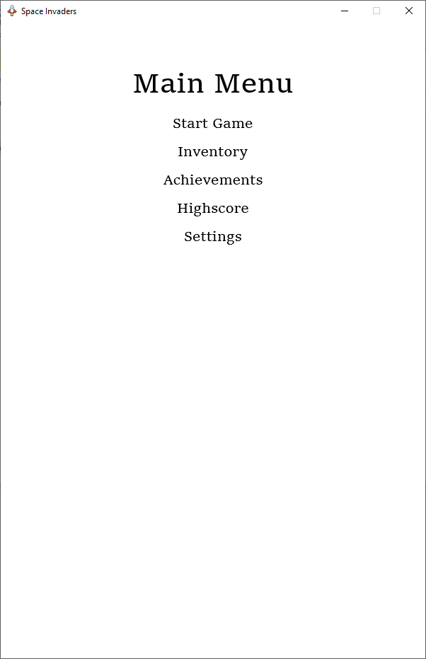
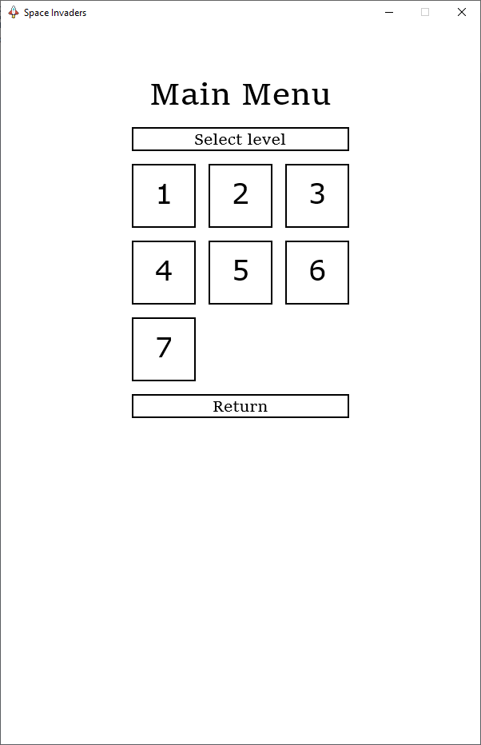
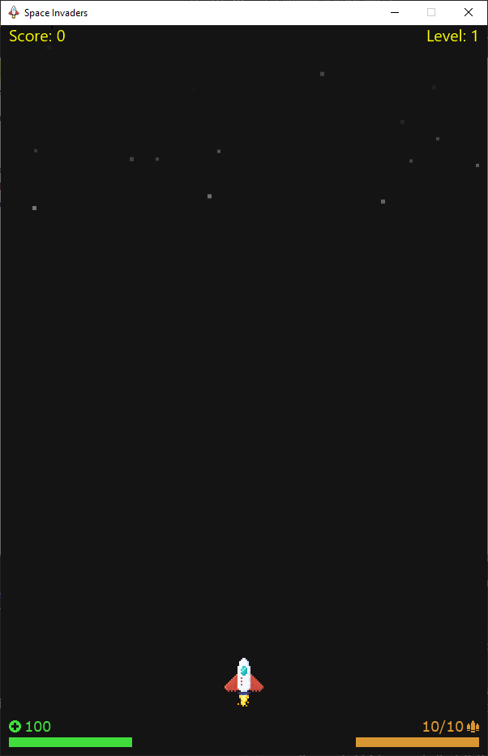
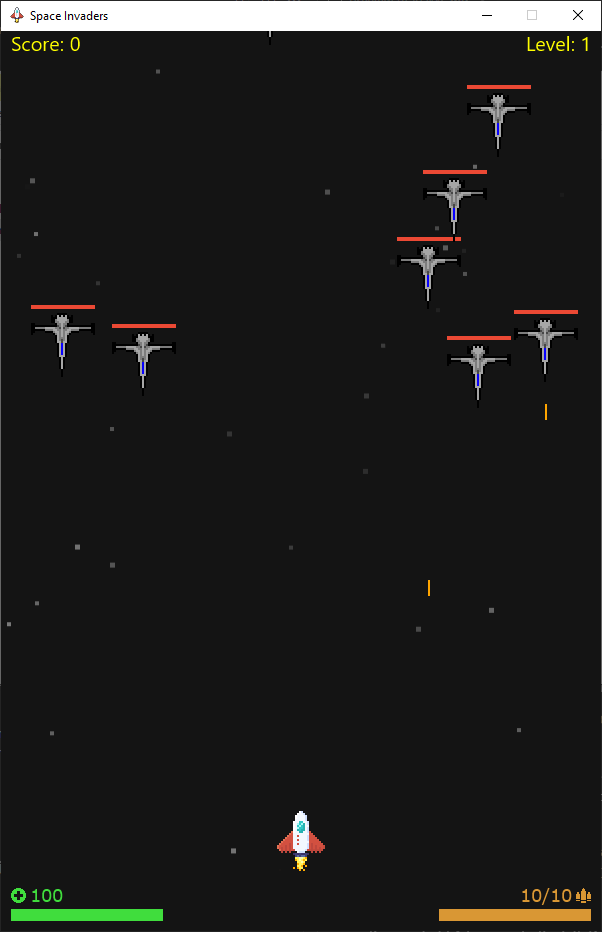
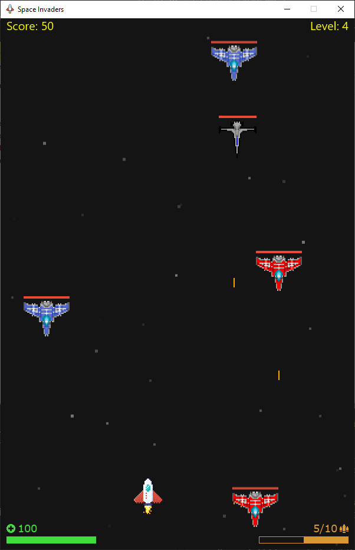
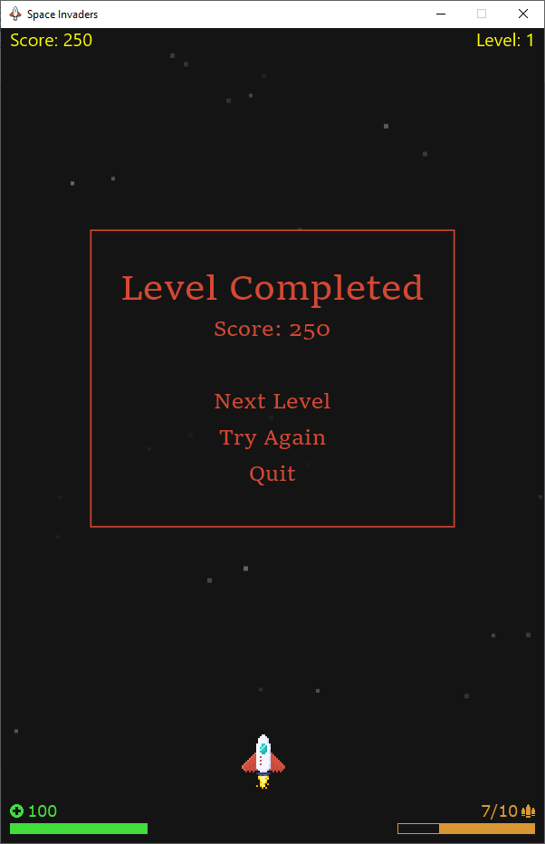
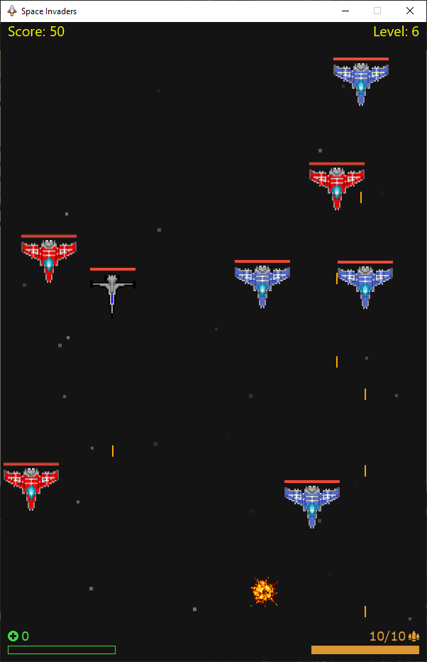
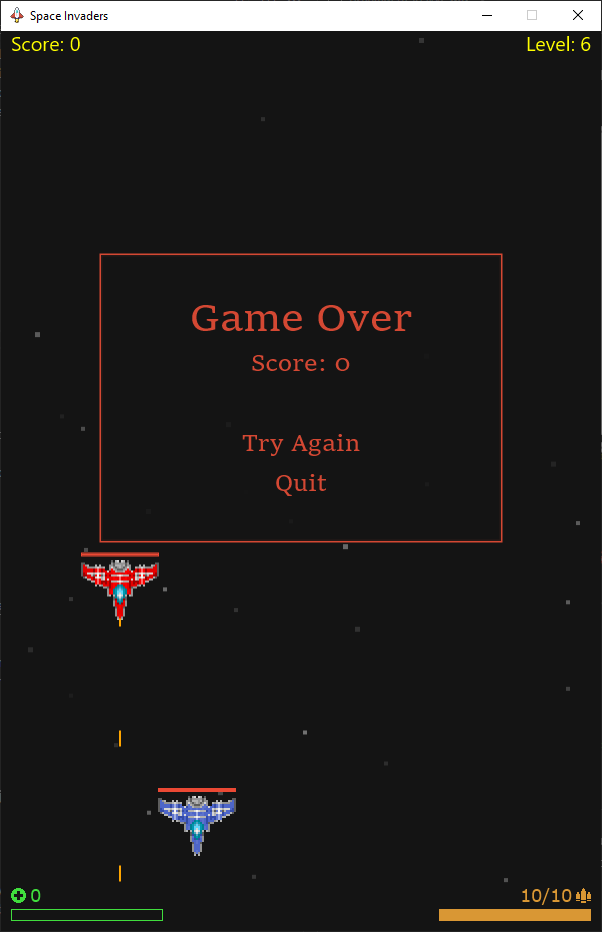

# alexgu-joakimai-project

Originally developed on KTH GitHub and ported over to the official GitHub but the commit history is mostly preserved. Project is left as relatively unfinished (only Main Menu button "Start Game" working, final level was intended to be a "boss battle" but that feature was not implemented) with passing (highest) grade in the course.

### Description

This project was developed in the course "DD1349 Projektuppgift i introduktion till datalogi". It is a game that combines elements from the games Space Invaders and Space Runner. It was created using Java and JavaFX. The core features of the game are the following: The player has the ability to move the space ship horizontally, as well as shoot and destroy enemy spaceships. By destroying enemies, the player gains points, which is displayed on the screen. The enemies move vertically, and have different levels of health (amount of bullets required to destroy them), varying velocities, the ability to shoot and destroy the player, different fire rates, and the ability to be destroyed (animated as an explosion). If the player is killed before the enemies are killed, the player has the option to try the same level again or quit the game. If all the enemies are killed and the player survives, the player has the option to move on to the next level, try the same level again or quit the game. There are currently seven levels, and the levels increase in difficulty. Additionally, the levels can be configured by editing the [game_levels.txt](/src/Assets/Levels/game_levels.txt) (see the comments in it for instructions).

### Images

 
 
 
 
 
 
 
 

# How-to guides:

The application has been developed using the JavaFX SDK (version 16, but may work with earlier versions). The IDE we used was IntelliJ and therefore the guides linked will be for IntelliJ, but there are alternatives. This guide is also mostly based off of the official [JavaFX documentation](https://openjfx.io/openjfx-docs/).

### How to *run* the application

1. Clone this repository.

2. Download the appropriate [JavaFX SDK](https://gluonhq.com/products/javafx/) for your operating system and unzip it to a desired location.

3. Open the terminal of your choice (Windows' Command Prompt is recommended and the only one which has been tested for the following command) and navigate to the "src" folder you just cloned.

4. Now, run the following command :

  `
  javac --module-path "X:\PATH\TO\lib" --add-modules javafx.controls *.java && java --module-path "X:\PATH\TO\lib" --add-modules javafx.controls Main
  `

  where `X:\PATH\TO\lib` should be changed to the filepath of the "lib" folder in the JavaFX folder you previously downloaded. For example, if you unzipped it to your Downloads folder its filepath should look a little like `C:\Users\alexg\Downloads\javafx-sdk-16\lib`, then the command you want to run becomes:

  `
  javac --module-path "C:\Users\alexg\Downloads\javafx-sdk-16\lib" --add-modules javafx.controls *.java && java --module-path "C:\Users\alexg\Downloads\javafx-sdk-16\lib" --add-modules javafx.controls Main
  `

### How to play

Press or hold A to move to the left, D to move to the right, press SPACE to shoot, and press R to reload.
Complete a level by surviving until all enemy ships have either been destroyed or passed by the end of the screen.

### How to *edit* the application

1. Install IntelliJ.

2. Download the appropriate [JavaFX SDK](https://gluonhq.com/products/javafx/) for your operating system and unzip it to a desired location.

3. Open the project in IntelliJ.

4. Set the Project SDK to Java version 16 (or anything above or equal to 11). You can do this by clicking `File` -> `Project Structure` -> `Project`.

5. Create a library by going into `File` -> `Project Structure` -> `Libraries` and clicking the plus sign. Select the lib folder which is in the JavaFX SDK folder that you just downloaded and click apply.

6. Lastly, go into `Run` -> `Edit Configurations...` and add the following line as VM options: `--module-path "\path\to\javafx-sdk-15.0.1\lib" --add-modules javafx.controls,javafx.fxml`. You might have to click the dropdown "Modify options" and enable "VM Options" in order for said setting to appear. The value for `--module-path` (`\path\to\javafx-sdk-15.0.1\lib`) should be changed to the path to the exact same lib folder that you previously downloaded.

7. Now you should be able to edit the program from within IntelliJ.
